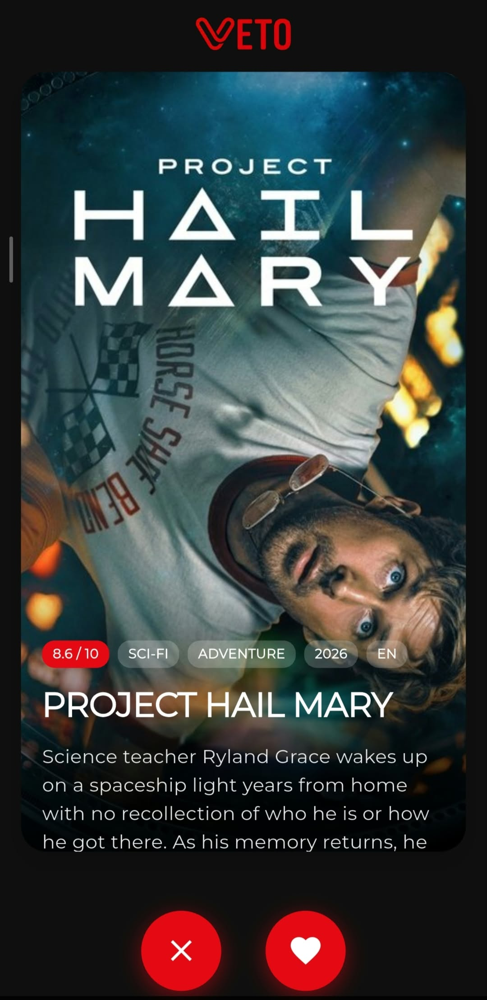
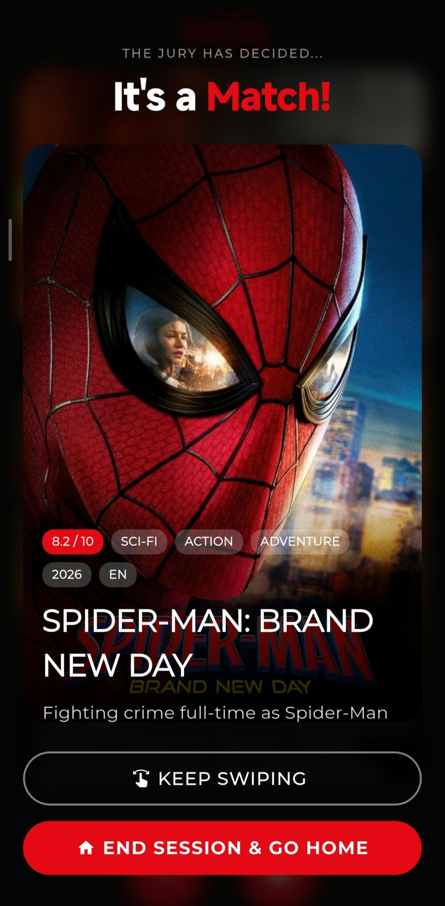
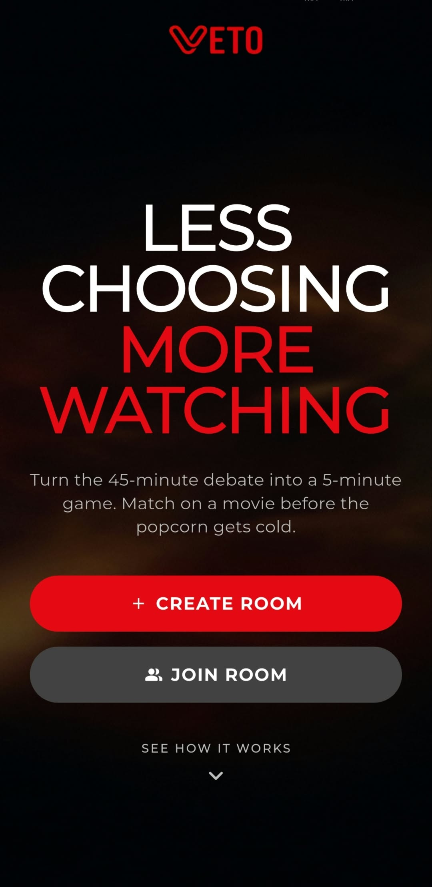
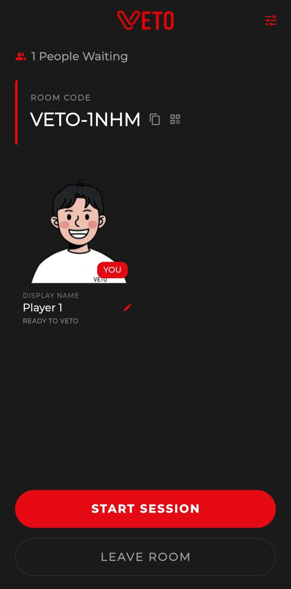
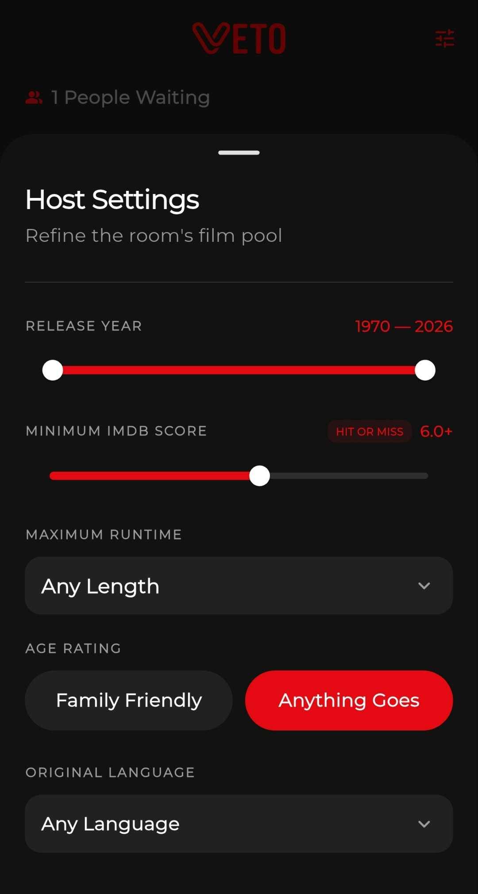
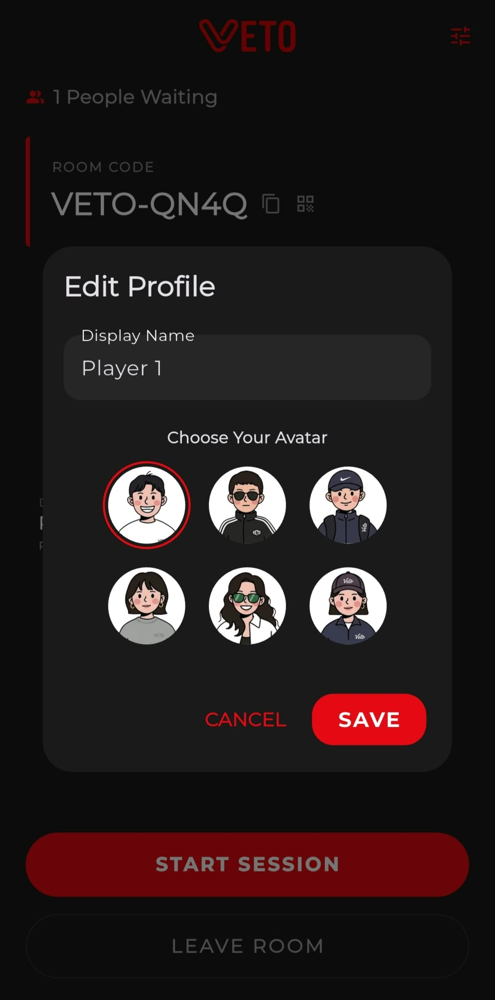
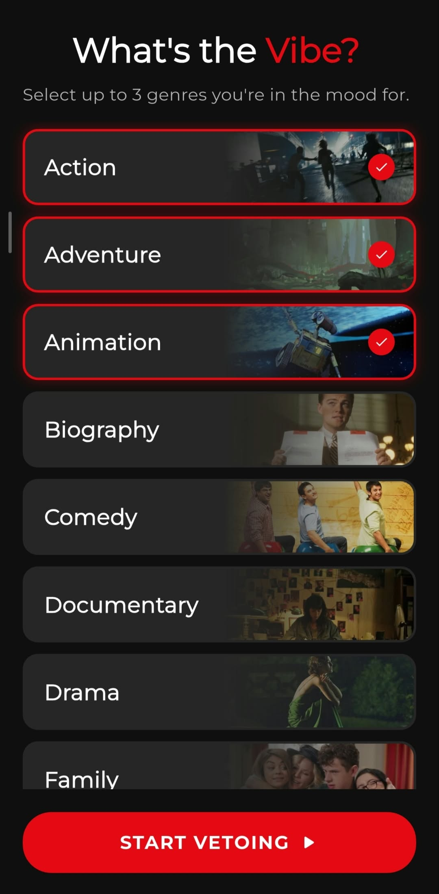
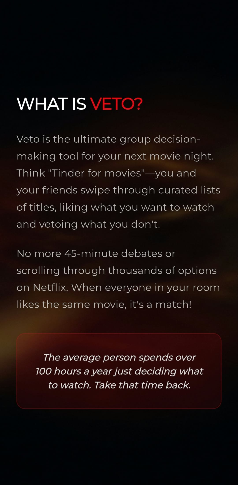
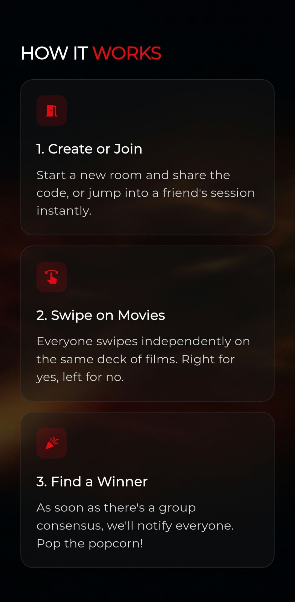

# VETO

### Find your next movie night pick, together.

Veto helps friends decide what to watch without the endless scrolling and back-and-forth. Create a room, invite your group, and swipe through movies tailored to your preferences. When everyone likes the same film, you have a match.

**[Click here to download Veto.](assets/apk/veto.apk?raw=true)**

## How it works

1. **Gather your group.** Create a room and share its code or QR code with friends.
2. **Set your preferences.** Choose genres, customize your profile, and let the host refine the movie pool.
3. **Swipe and decide.** Swipe right to like a movie or left to veto it. A shared pick appears when everyone agrees.

No account registration is needed. Use separate devices to try the group experience; an internet connection is required.

## Features

### Host a movie night

- Create a shared room and invite friends using a room code or QR code.
- Refine the movie pool by release year, minimum score, runtime, age rating, and original language.
- See who has joined, manage participants, and start the session.

### Join and vote

- Join a room by entering its code or scanning its QR code.
- Choose a display name and avatar, then select your preferred genres.
- Browse movie cards and vote with swipe gestures.
- Find a movie everyone wants to watch, with room activity and votes synced in real time.

## Screenshots

### From movie browsing to a shared pick

  
  

### Create or join a room

  
  

View joining, host settings, and profile customization

**Join a room**

**Host settings**

**Customize your profile**

### Choose your genres

View the app introduction and how-to guide

**About Veto**

**How to Veto**

## Built with

- **Flutter & Dart** for the mobile interface.
- **Riverpod** for state management and dependency injection.
- **Firebase Cloud Firestore** for shared rooms and live voting updates.
- **The Movie Database (TMDB) API** for movie discovery, details, and posters.

The codebase uses Clean Architecture with shared domain models, repository interfaces, and business logic in `lib/core/`, alongside feature-based screens and widgets in `lib/features/`.
